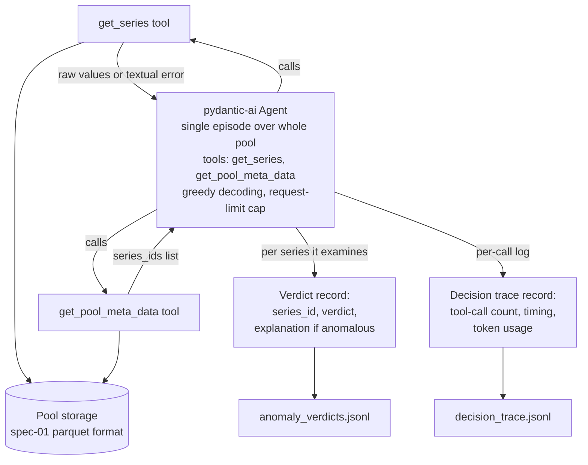

## 02-raw-retrieval-baseline-agent-infrastructure-spec

### 1. Executive summary

#### 1.1 Spec description

Build a raw-retrieval-only baseline agent: a single LLM tool-calling agent invocation, equipped only with tools for retrieving raw time-series data and pool metadata (no analysis-specific tools), that autonomously traverses a pool of series (per the data spec) and produces per-series anomaly verdicts, with explanations for series flagged anomalous. The agent has no access to any anomaly-detection-specific tool (no cheap scan, no deep detect) — only raw retrieval and pool metadata discovery.

#### 1.2 Spec motivation

RQ1 in the constitution spec compares a tool-augmented agent against a raw-retrieval-only agent. This baseline agent must exist and produce a comparable, machine-checkable output before that comparison (M3) can be run. It is also the first of the three concrete deliverables the constitution roadmap assigns to M1.

#### 1.3 Implementation repos

tsagent (single repo, degenerate case — management and implementation repo are the same); work lands in `code/`.

### 2. Requirement analysis

#### 2.1 Functional requirements

- **FR1**: A tool `get_series(series_id) -> {time_index[], value[]}` that returns the full raw series for a given ID (no anomaly-specific derived fields); returns a textual error message when the ID is unknown or the series is malformed.
- **FR2**: A tool `get_pool_meta_data() -> {series_ids[]}` that returns the list of `series_id`s in the pool (extensible to more pool-level metadata fields in the future).
- **FR3**: An agent harness built with pydantic-ai, handling the tool-calling loop, tool registration, and execution mechanics. `get_series` and `get_pool_meta_data` are the only tools registered with it — no cheap_scan, no deep_detect, no other analysis tool.
- **FR4**: A single agent invocation is given the entire pool to work with in one episode: the agent discovers the pool's series via `get_pool_meta_data` and drives itself through examining series (via `get_series`) at its own discretion, emitting a verdict for each series it examines. Full coverage of the pool is not guaranteed — the agent may stop before examining every series (see Insight, §4.1).
- **FR5**: The agent emits `anomaly_verdicts.jsonl`, one record per series it examines, each containing: `series_id`, a binary `verdict` (`anomalous` / `normal`), and — for series verdicted `anomalous` only — an `explanation` grounded in what the agent retrieved via `get_series` (e.g., referencing specific raw values/positions it saw). No numeric anomaly score is produced; ranking-style evaluation is out of scope for this baseline.
- **FR6**: A decision trace logging tool-call activity across the episode (e.g., which series were examined, how many times `get_series` was called per series), per-call timing, and token usage, for budget/cost accounting — separate from the qualitative explanation, which lives in `anomaly_verdicts.jsonl`.
- **FR7**: Deterministic replay: same pool + same agent config (model, prompt, seed if applicable) → same output.

#### 2.2 Non-functional requirements

- Context-token consumption per run must be logged (not necessarily bounded here — RQ3's context-efficiency comparison happens later, but this agent is a reference point for that comparison, so its token usage must be measurable from the run's own logs).

### 3. Acceptance criteria

**Unit-level (no LLM, no GPU — runs in CI)**
- Agent config (model, prompt, tool registration) exposes exactly the two tools — `get_series` and `get_pool_meta_data` — and no others are registered with the pydantic-ai harness. (FR3)
- `anomaly_verdicts.jsonl` schema validation: every record has `series_id`, `verdict` ∈ {`anomalous`, `normal`}; `explanation` present iff `verdict == anomalous`, absent/null otherwise. (FR5)
- Decision-trace record schema validation: per-series tool-call count, timing, and token-usage fields present and well-typed. (FR6)

**End-to-end (full pool, manual run — not gated in CI due to LLM cost)**
- Running twice on the same pool with the same config produces identical `anomaly_verdicts.jsonl` and decision-trace output (byte-for-byte or field-for-field). (FR7 — determinism)
- Full run over one real dataset (R1 or R2, per spec 01) completes without missing verdicts and without exceeding the LLM token budget from the constitution's resource constraints.

### 4. Insight

#### 4.1 Retrieval/interaction protocol

**Idea A — Single-pass whole-series-in-context verdict**
The agent first calls `get_pool_meta_data` to obtain the list of series, then for each series calls `get_series(series_id)` once, injects the full raw sequence into the LLM's context in one shot, and asks for a binary verdict + explanation in a single turn. Simplest possible loop: one tool call per series, no iterative exploration.
Rejected: too rigid — treats the agent as a fixed one-shot classifier rather than genuinely exercising the tool-calling harness, and gives no room for the agent to manage its own retrieval strategy on long series.

**Idea B — Agent-driven multi-series, multi-turn exploration (chosen)**
The agent operates in a single episode over the whole pool: it first calls `get_pool_meta_data` to discover which series exist, then decides on its own — turn by turn — which series to examine, how many times to call `get_series` for a given series (e.g., re-examine it across turns) before committing to a verdict, and when to move on to the next series or stop entirely. This matches the "agent" framing from the constitution (planning + tool-call routing) even in this minimal two-tool case, and is a fairer baseline: it isn't crippled by a fixed protocol, so the RQ1 comparison against tool-augmented agents in M2/M3 isolates the effect of *having analysis tools*, not the effect of *the baseline being forced into an artificially rigid loop*. Note this also means the agent may fail to cover the whole pool (e.g., stop early) — that is a property of the baseline itself, not something the harness corrects for.

**Idea C — Batched multi-series calls**
The agent first calls `get_pool_meta_data` to obtain the list of series, then calls `get_series` for several series IDs at once (batch tool call) and produces verdicts for the whole batch in one LLM turn, to reduce the number of LLM turns for large pools.
Rejected: optimizes for scale/throughput, not called for by any FR, and adds complexity (batch schema, partial-batch failure handling) not currently justified.

**Decision:** Idea B. The retrieval/interaction protocol is a single agent-driven episode over the whole pool — the pydantic-ai harness runs one tool-calling loop in which the agent discovers the pool via `get_pool_meta_data` and freely decides which series to examine, how many times (if any) to call `get_series` per series, and when to move on or stop, rather than being forced into a fixed single-call-per-series protocol (Idea A) or a batched multi-series protocol (Idea C).

#### 4.2 Prompt engineering for efficiency

Given Idea B, an open design question is how to prompt the agent so it handles long raw series economically — since `get_series` returns the full raw sequence, a naive prompt invites the agent to prefill/re-quote large spans of data across turns, blowing up both latency (E2E time) and token count (generated + prefilled).

**Idea B1 — Explicit efficiency instruction ("budget-aware" system prompt).** Tell the agent directly, in the system prompt: series can be long, minimize retrieved/re-quoted content, avoid restating raw values verbatim in intermediate reasoning, and aim to terminate in as few turns as possible once confident. This is a pure prompt-engineering intervention — no protocol change.

**Idea B2 — Structural nudge via retrieval design + prompt.** Beyond instruction, shape the interaction so the natural path is efficient: instruct the agent to reason in terms of indices/ranges rather than re-embedding raw values in its own generated text, and explicitly ask it to output a final verdict as soon as internal confidence is reached rather than continuing to "explore." Uses the same two tools (`get_series`, `get_pool_meta_data`; no new tool), but pairs the instruction with an explicit stopping/confidence protocol in the prompt.

Chosen: **B1 as the primary approach, with the stopping/confidence element of B2 folded in.** The stopping instruction is cheap to add and directly reduces the number of turns, which is the dominant cost driver in a multi-turn agent. B2's "reason in indices not raw values" nudge is harder to enforce with prompting alone and is left as a candidate for later prompt-tuning iteration rather than a hard requirement in this first version.

### 5. Overall solution design

#### 5.1 High-level design

#### 5.2 Core components

- **Pool storage**: the series pool in the unified format defined by spec 01 (parquet); `get_series` and `get_pool_meta_data` both read from it.
- **`get_pool_meta_data` tool**: returns the list of `series_id`s in the pool, giving the agent the means to discover what it can examine.
- **`get_series` tool**: given a `series_id`, returns `{time_index[], value[]}` from pool storage; returns a textual error message (not a raised exception surfaced to the harness) when the ID is unknown or the series is malformed, so the LLM can read and reason about the failure.
- **Baseline agent (pydantic-ai)**: one `Agent` instance, invoked once per run, configured with `get_series` and `get_pool_meta_data` as its only tools, greedy decoding (temperature 0 / no sampling), and a pydantic-ai request-limit setting capping total tool calls for the whole episode to prevent runaway loops. System prompt implements the section-4.2 efficiency instructions (minimize re-quoted raw content, terminate promptly once confident per series). Which series the agent examines, in what order, and how many times it calls `get_series` per series is entirely up to the agent; nothing in the harness enforces full coverage of the pool.
- **Verdict writer**: collects the agent's per-series verdicts as it produces them and appends a record to `anomaly_verdicts.jsonl` (per FR5).
- **Decision-trace writer**: collects tool-call activity, timing, and token-usage stats across the episode and appends records to `decision_trace.jsonl` (per FR6, and the NFR on context-token logging).

### 6. Implementation plan

#### 6.1 Implementation repos

tsagent (single repo, degenerate case) — work lands in `code/`.

#### 6.2 Todo list

1. Implement pool storage + `get_pool_meta_data` and `get_series` tools.
2. Configure the pydantic-ai baseline agent (tools, greedy decoding, request-limit cap, efficiency-focused system prompt).
3. Implement verdict and decision-trace writers.
4. Wire the single-invocation run script end-to-end.
5. Add unit tests for tool registration and output schemas.
6. Run manual end-to-end checks: determinism (FR7) and a full run on a real dataset within budget.

#### 6.3 Modification summary

| File | Action |
|------|--------|
| `code/src/run_baseline_agent.py` | New — entry point wiring tools, agent, and writers into the single-invocation run |
| `code/tests/test_tools.py` | New — tool registration + `get_series`/`get_pool_meta_data` behavior |
| `code/tests/test_output_schemas.py` | New — `anomaly_verdicts.jsonl` / `decision_trace.jsonl` schema validation |
| (supporting modules: tools, agent config, prompt, writers) | New — left to implementer's discretion |
